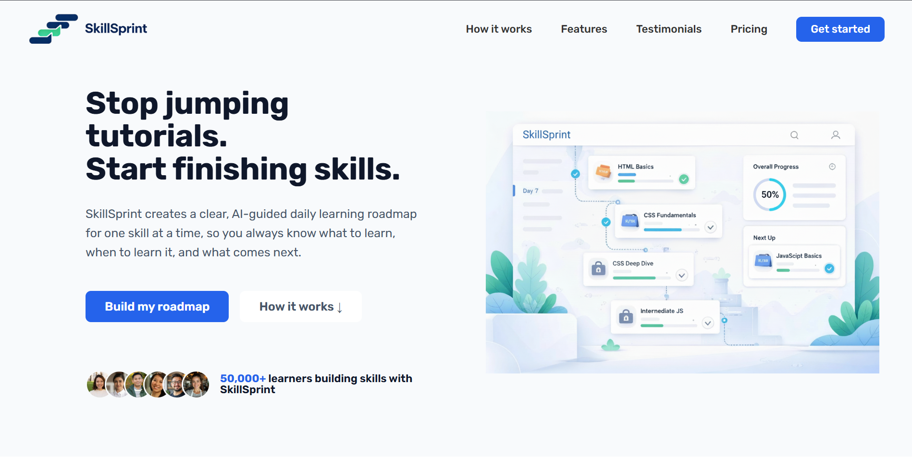
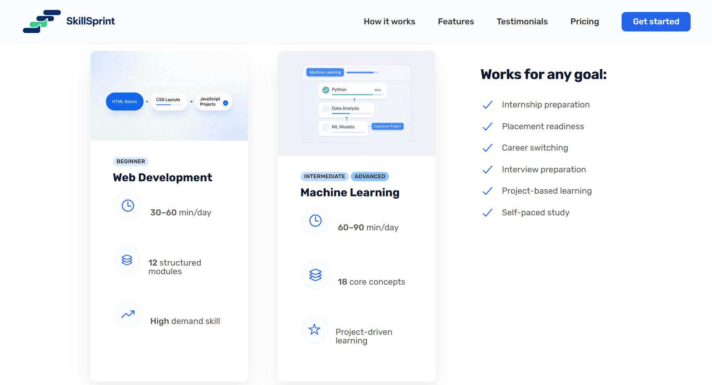
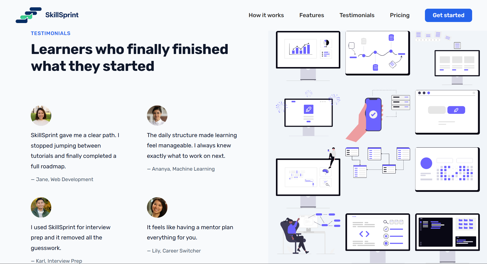
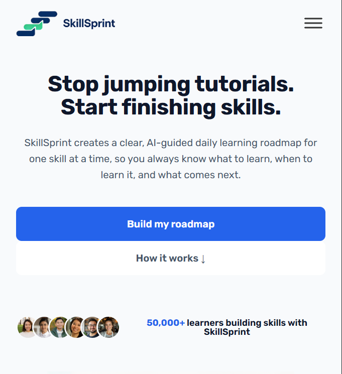
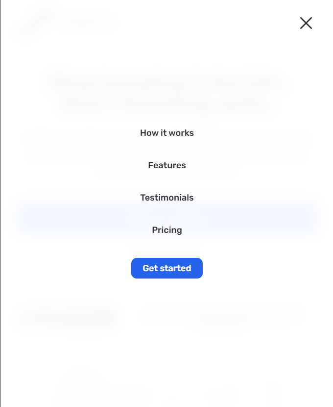
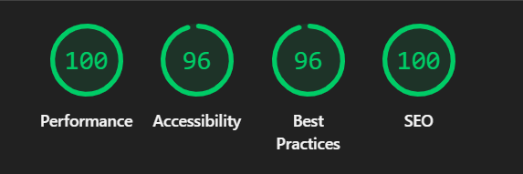

# SkillSprint

**SkillSprint — Learning Roadmaps, Simplified**

SkillSprint is a responsive **frontend landing page** that showcases the concept of an AI-guided skill-building platform designed to help learners follow clear, structured learning roadmaps instead of jumping between random tutorials.

This project focuses on **UI/UX, responsiveness, performance, and frontend engineering quality**, and represents how SkillSprint would look and feel as a real startup landing experience.

---
## 🚀 Live Demo

Explore the SkillSprint landing experience:

🔗 https://skillsprint-app.netlify.app

This is a production-ready frontend prototype demonstrating how SkillSprint would look and feel as a real startup product.

## 🔑 Key Features

📱 **Fully Responsive Design**  
Optimized for desktop, tablet, and mobile using structured media queries.

🧭 **Modern Navigation Experience**  
Sticky header, mobile navigation, and smooth scrolling interactions.

🧩 **Feature-Driven Layout**  
Clear sections that communicate value, roadmap structure, and learner outcomes.

⚡ **Performance-Focused Frontend**  
Lighthouse-tested with excellent performance, accessibility, and SEO scores.

---

## 🛠 Tech Stack

- **HTML5** — Semantic, accessible markup  
- **CSS3** — Grid, Flexbox, custom properties, responsive breakpoints  
- **Vanilla JavaScript** — UI interactions and behavior  
- **No frameworks or libraries**

Built entirely from scratch to demonstrate strong frontend fundamentals.

---

## 📐 Responsiveness & Layout

SkillSprint adapts seamlessly across screen sizes:

- Large desktops  
- Tablets (landscape & portrait)  
- Mobile devices  

Responsive behavior includes:

- Adaptive grid layouts  
- Mobile-first navigation  
- Conditional rendering of visual elements  
- Touch-friendly UI controls  

---

## ⚙️ JavaScript Functionality

JavaScript enhances the UX without overengineering:

1. Mobile navigation toggle  
2. Smooth anchor scrolling  
3. Sticky header using Intersection Observer  
4. Dynamic year rendering  
5. Feature detection for layout compatibility  

All logic is clean, modular, and production-ready.

---

## 📊 Performance & Quality

This landing page is optimized for real-world performance.

**Lighthouse Scores:**

- ⚡ Performance: **100**
- ♿ Accessibility: **96**
- ✅ Best Practices: **96**
- 🔍 SEO: **100**

---

## 🎯 Purpose & Vision

This project was built to:

1. Simulate a startup-ready landing page  
2. Demonstrate frontend engineering skills  
3. Showcase attention to performance, accessibility, and UX  
4. Serve as a foundation for a future full-stack product  

SkillSprint is intentionally scoped as a **frontend landing experience**, reflecting how real startups validate ideas before building full systems.
## 🖼 Preview

### Hero Section
Introduces the SkillSprint value proposition with a clear headline, supporting copy, and primary call-to-action. Designed to immediately communicate purpose and guide users forward.

---

### Features & Roadmaps
Highlights example learning roadmaps (Web Development, Machine Learning) with structured modules, time commitment, and skill level indicators.

---

### Testimonials
Displays learner feedback alongside illustrative visuals to reinforce credibility and outcomes in a clean, modern layout.

---

### Mobile Experience
Fully responsive layout with mobile navigation and optimized spacing.

## Lighthouse Score

